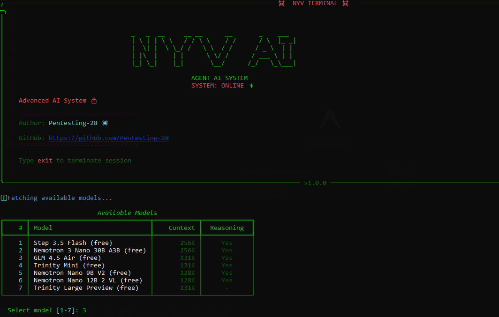
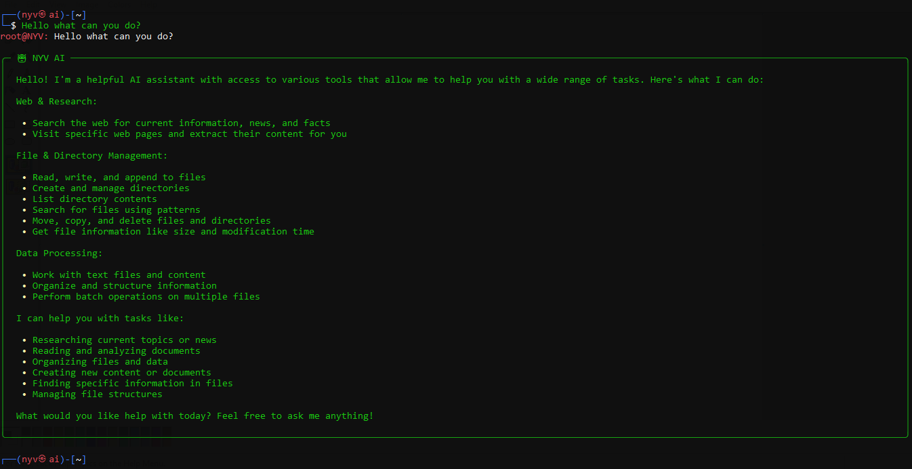

# Nyv-Agent-AI: Advanced Agentic System

Nyv-Agent-AI is a professional-grade AI orchestrator built on Clean Architecture and SOLID principles. It provides a decoupled, scalable foundation for autonomous task execution with a resilient communication layer and a robust tool-calling system.




---

## Technical Architecture

The project follows a Hexagonal Architecture pattern, ensuring the core agent logic remains independent of external providers and infrastructure.

```text
┌──────────────────┐          ┌──────────────────┐          ┌──────────────────┐
│   Agent Layer    │          │    Core Layer    │          │    LLM Layer     │
│ (Orchestrator)   │          │ (Abstractions)   │          │ (Client & Logic) │
└────────┬─────────┘          └────────┬─────────┘          └────────┬─────────┘
         │                             ^                             │
         │ (uses)                      │ (implements)                │ (manages)
         v                             │                             v
┌──────────────────┐          ┌──────────────────┐          ┌──────────────────┐
│  Tool Registry   │──────────>│    BaseTool      │<──────────│  Model Fetcher   │
└────────┬─────────┘          └──────────────────┘          └──────────────────┘
         │                             ^
         │ (discovers)                 │
         v                             │
┌──────────────────┐          ┌────────┴─────────┐          ┌──────────────────┐
│ FileSystem Tools │          │  WebSearch Tool  │          │   VisitURL Tool  │
└──────────────────┘          └──────────────────┘          └──────────────────┘
```

### Core Design Principles

- **Dependency Injection**: The agent accepts its dependencies (LLM, Registry) via constructor, facilitating unit testing.
- **Resiliency Layer**: Automatic exponential backoff for 429 (Rate Limit) and 5xx (Gateway) errors.
- **Robust JSON Extraction**: A custom brace-balancing algorithm ensures high precision even when models output malformed JSON.
- **DTO-Based Communication**: Standardized data transfer objects ensure data integrity across system boundaries.

---

## Key Features

- **Dynamic Model Selection**: Fetches and filters available free models from OpenRouter at startup.
- **High-Precision Parsing**: Robust extraction of tool calls using a nested-aware balancing logic.
- **API Resiliency**: Built-in retry mechanism with 2s -> 4s -> 8s backoff, respecting the `Retry-After` header.
- **Intelligent Parameter Mapping**: Automatically resolves common LLM hallucinations (e.g., mapping `file_path` to `path`).
- **Extensible Toolset**: Modular tools for FileSystem operations, Web Search (DuckDuckGo), and URL to Markdown rendering (BrowserFly).
- **Verified Stability**: Comprehensive unit test suite with 41 tests covering all core components.

---

## Project Structure

```text
├── src/
│   ├── core/           # Interfaces, Registry, and Centralized Config
│   ├── llm/            # LLM client and Model Fetching logic
│   ├── schemas/        # Data Transfer Objects (DTOs)
│   ├── tools/          # FileSystem and Network tools
│   ├── console_ui.py   # Terminal interface
│   ├── agent.py        # Orchestration and Parsing logic
│   └── app.py          # Composition Root
├── tests/              # Automated Test Suite (Pytest)
├── .env                # API Keys and Environment settings
└── requirements.txt    # Project Dependencies
```

---

## Installation & Setup

1. **Clone & Enter**:
   ```bash
   cd Nyv-Agent-AI
   ```

2. **Initialize Environment**:
   ```bash
   python -m venv .venv
   source .venv/bin/activate  # Windows: .venv\Scripts\activate
   pip install -r requirements.txt
   ```

3. **Configure API**:
   Create a `.env` file with your OpenRouter key:
   ```env
   OPENROUTER_API_KEY=your_openrouter_key_here
   OPENROUTER_API_URL=https://openrouter.ai/api/v1
   ```

4. **Run System**:
   ```bash
   python -m src
   ```

---

## Tool Portfolio

| Tool | Category | Functionality |
| :--- | :--- | :--- |
| `write_file` | File System | Atomic file writes with automatic parent directory creation. |
| `read_file` | File System | Read content with UTF-8 encoding. |
| `search_files` | Search | Recursive glob-pattern file discovery. |
| `web_search` | Network | Real-time search via DuckDuckGo HTML interface. |
| `visit_url` | Network | Extracted Markdown rendering of any webpage via BrowserFly. |
| `batch_move` | Utility | Orchestrated multi-item restructuring. |
| `list_directory` | File System | Grouped navigation and metadata listing. |

---

## Quality Assurance

Reliability is guaranteed through a rigorous automated testing pipeline.

**Run All Tests**:
```bash
$env:PYTHONPATH = "."; .venv\Scripts\pytest.exe tests/
```

*Current Status: 41 Passed, 0 Failed.*

---

## Author

- **Pentesting-28**
- **GitHub**: [https://github.com/Pentesting-28/Nyv-Agent-AI](https://github.com/Pentesting-28/Nyv-Agent-AI)

---

*NYV-AI: Clean Code. Scalable Design. Professional Intelligence.*
